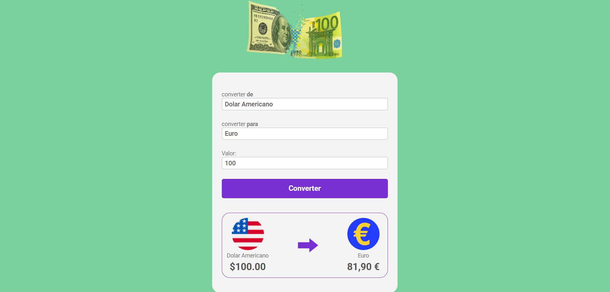

# 💱 Conversor de Moedas - 

Este projeto é um conversor de moedas simples, responsivo e estilizada. Ele permite converter valores entre **Real Brasileiro (BRL)**, **Dólar Americano (USD)** e **Euro (EUR)**, apresentando as taxas de câmbio pré-definidas.

## ✨ Funcionalidades

- Conversão instantânea entre R$, US$ e €.
- Exibição do valor formatado de acordo com a moeda.
- Imagens e nomes dinâmicos para cada moeda selecionada.
- Logotipo animado representando a direção da conversão.
- Estilo moderno e responsivo utilizando CSS puro.

---

## 📸 Preview

 

---

## 🛠️ Tecnologias utilizadas

- CSS puro
- HTML semântico
- JavaScript moderno (ES6+)
- Formatação monetária com `Intl.NumberFormat`

---

## 📦 Como acessar 

 -

